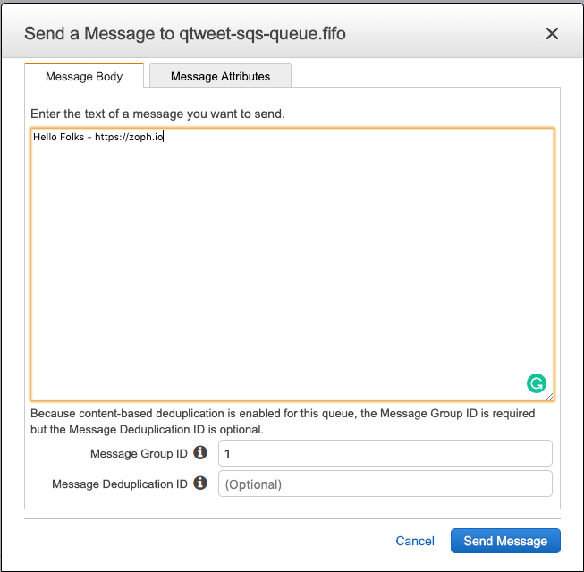

# qtweet

Dead simple AWS SQS to Twitter serverless speaker :speaker:.

> Publish message :love_letter: to SQS (FIFO), Lambda function will handle publishing it to Twitter. Automagically. :tada:

To be honest, my plan is to automate the tweet of certain information using this queue in multiple side projects.

As usual, I'm sharing this with you folks as I was not able to find equivalent in Github / Open source projects. I hope it could be useful to someone else.

## Getting started

> Update variables in `Makefile` and `tf/variables.tf` according to your environment.

- type `make` to get started (help)

### Requirements

- AWS Account
- Twitter [API Keys](https://developer.twitter.com/en/docs/basics/apps/guides/the-app-management-dashboard)
- Terraform

### How to deploy on my AWS Account

- `make all` (all-in-one command)

#### Manual - Under the hood (for Plumbers)

1. `make artifacts` (create S3 bucket)
2. `make package` (create the zip artifact)
3. `make tf-init` (to prepare terraform deployment)
4. `make tf-validate` (**optional**) validate the IaC + FMT
5. `make tf-plan` (**optional**) Dry-Run
6. `make tf-apply` Deploy the infrastructure as code

_nb: Terraform is using remote state on S3._

#### Setup Twitter secrets

> How to get Twitter API Keys: https://developer.twitter.com/en/docs/basics/apps/guides/the-app-management-dashboard

After you've deployed the Terraform you will need to set Twitter API Keys manually to AWS Secret Manager using AWS console.

Set the following credentials in AWS Secret Manager:

1. Consumer Key
2. Consumer Key Secret
3. Access Token
4. Access Token Secret

### How to publish a message

#### Using AWS Console



#### Using AWSCLI

`aws sqs send-message --queue-url https://sqs.us-east-1.amazonaws.com/80398EXAMPLE/MyQueue --message-body "Information about the largest city in Any Region." --delay-seconds 10 --message-attributes file://send-message.json`

Doc: https://docs.aws.amazon.com/cli/latest/reference/sqs/send-message.html

#### Using Python (boto3)

```python
import boto3

# Create SQS client
sqs = boto3.client('sqs')

queue_url = 'SQS_QUEUE_URL'

# Send message to SQS queue
response = sqs.send_message(
    QueueUrl=queue_url,
    DelaySeconds=10,
    MessageAttributes={
        'Title': {
            'DataType': 'String',
            'StringValue': 'The Whistler'
        },
        'Author': {
            'DataType': 'String',
            'StringValue': 'John Grisham'
        },
        'WeeksOn': {
            'DataType': 'Number',
            'StringValue': '6'
        }
    },
    MessageBody=(
        'Information about current NY Times fiction bestseller for '
        'week of 12/11/2016.'
    )
)

print(response['MessageId'])
```

Doc: https://boto3.amazonaws.com/v1/documentation/api/latest/guide/sqs-example-sending-receiving-msgs.html

## Contributing

Pull requests are welcome. For major changes, please open an issue first to discuss what you would like to change.

Please make sure to update the tests as appropriate. (just kidding, there is no test)

## License

[MIT](./LICENSE)

### Credits

- [AWS SQS](https://aws.amazon.com/sqs/)
- [AWS Lambda](https://aws.amazon.com/lambda/) function
- [AWS Secrets Manager](https://aws.amazon.com/secrets-manager/)
- [Tweepy](http://www.tweepy.org/) Python Library
